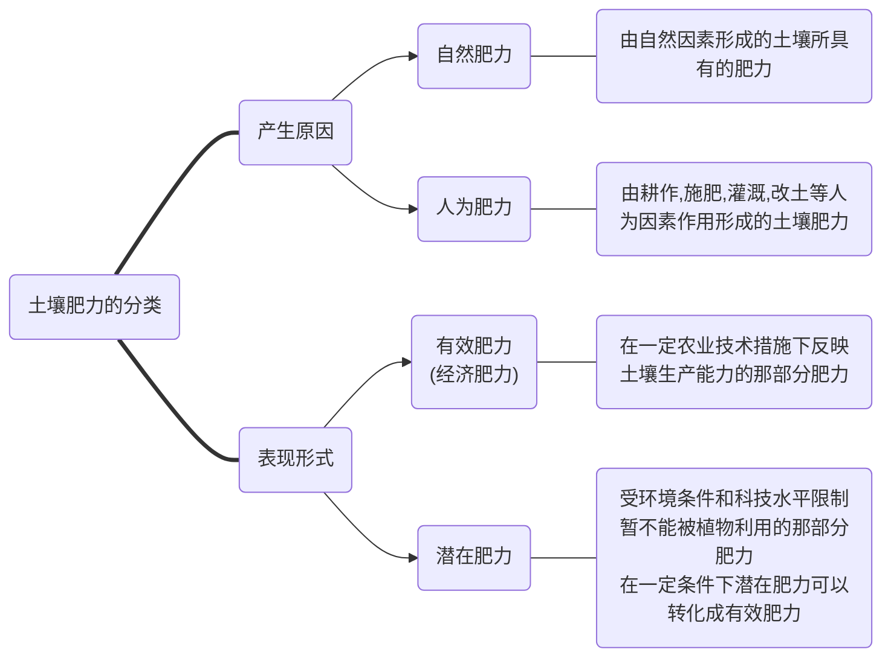

# 土壤肥料学通论


[一些其他的复习资料 (station724.github.io)](https://station724.github.io/TimeInNJAU.github.io/)


[TOC]


## **第一章：绪论**

### 1. 土壤

- **土壤的概念**
  - 陆地表面由矿物质、有机物质、水、空气和生物组成、具有肥力且能生长植物的未固结层

- **土壤的基本物质组成**
  - 

- **土壤肥力的概念**

  - 土壤供应与协调植物正常生长发育所需的养分、水分、空气和热量的能力

    （狭义：土壤供给植物必须养分的能力）




### 2. 肥料

- **肥料的概念**
  - 能够直接共给植物生长的必须的营养元素物料（分为有机、化学肥料）


## **第二章：土壤的基本物质组成**

### 1. 土壤矿物质和岩石分化

#### A. 概念

-------

1. **矿物**

   - 定义：土壤风化形成的矿物颗粒统称为土壤矿物质
   - 分类：
     1. **原生矿物**：风化过程中没有改变化学组成而遗留在土壤中的一类矿物
     2. **次生矿物**：原生矿物在风化和成土作用下，新形成的矿物

     ```mermaid
      graph LR
      A(土壤矿物质)==>B1("原生矿物")
      A==>B2("次生矿物")
      B1---|来源|C1(各种岩石受到不同程度的物理风化<br>而未经化学风化的碎屑物)
      B2---|来源|D1(由原生矿物经风化后重新形成新的矿物<br>其化学组分和构造都经过改变)
      B1---|主要种类|C2("主要包括石英和原生硅铝酸盐类")
      B1---|对土壤肥力的贡献|C3("主要分布在土壤的沙砾和粉粒为<br>植物生长发育提供矿质养分，并对植物体起支撑作用")
      B2---|主要种类|D2("主要包括简单盐类、次生氧化物和次生铝硅酸盐类等")
     ```

2. **岩石**

   - 定义：由一种或集中矿物组成的集合体    

   - 分类：<u>岩浆岩、沉积岩和变质岩</u>

     > 岩浆岩：地球内部熔融岩浆上浸地壳的一定深度或喷出地表冷却凝固所形成的岩石
     >
     > 沉积岩：地壳表面的岩石经风化、搬运、沉积等作用后在一定条件下胶结硬化形成
     >
     > 变质岩：岩浆岩或沉积岩受地壳运动或岩浆运动造成的高温高压和热气液作用发生变质产生  

3. **岩石矿物的风化**

   1. 物理风化
   2. 化学风化
   3. 生物风化
   
4. **五大成土因素**

   1. <u>生物</u>
   2. <u>母质</u>
      - 定义：矿物岩石经各种风化作用后形成的疏松多孔体
   3. <u>气候</u>
   4. <u>地形</u>
   5. <u>时间</u>

5. **土壤粒级**

   - 定义：土粒大小的等级
   - 分类：<u>石砾、砂砾、粉砂砾、粘粒</u>

6. **土壤颗粒组成**（土壤机械组成）

   - 定义：土壤中不同粒径矿质颗粒的组合比例，一般以各粒级所占百分比表示

   - > 根据需要，将待测土壤颗粒按照不同土壤粒级进行划分，确定了待测土壤机械组成，然后根据这个机械组成比例确定土壤质地。相对于粒级、质地，起到承上启下的作用

7. **土壤质地**

   - 定义：各粒级土壤颗粒在土壤中所占的相对比例或重量百分数

   - 分类：<u>砂土、壤土、粘土</u>
      ```mermaid
      graph TB
      A(不同质地土壤的肥力特性)===B1("砂土")
      A===B2("壤土")
      A===B3("粘土")
      B1---C1("水：通气透水性强，保水性弱</br>
      	气：通气性好，有机质分解快</br>
      	热：热容量较小</br>
      	肥：含养分少，保肥性差</br>
       	耕性：松散易耕，易沉淀·板结﹑闭气")
     B2---C2("水、气：通气透水性良好</br>
     热、肥：保水保肥，土温稳定</br>
     耕性：耕性较好，宜耕期较长")
     B3---C3("水：透水性差，保水抗旱力强</br>
     气：通气性差</br>
     热：热容量较大</br>
     肥：养分较丰富，保肥力强</br>
     耕性：宜耕期短")
     ```


#### B. 思考

--------

- **名词解释**
  - 矿物（原生矿物、次生矿物）
  - 岩石（岩浆岩、沉积岩、变质岩）
  - 土壤粒级
  - 土壤质地

- **简答**

1. **土壤质地与土壤肥力的关系？**
   - 土壤质地是土壤的重要物理性质之一，对土壤肥力有重要的影响
   - 土壤质地常常是土壤通气﹑透水﹑保水﹑保肥﹑供肥﹑保温、导温和耕性等的决定性因素
2. **土壤质地的改良措施？**
   - <u>增施有机肥料</u>（有机质的粘结力比砂粒强，比粘粒弱）
   - <u>掺砂掺粘、客土调剂</u>（泥入砂，砂掺泥，以改良质地，改善耕性）
   - <u>翻淤压砂、翻砂压淤</u>（下层砂土或粘淤土翻到表层使砂粘混合，改良土性）
   - <u>引洪放淤、引洪漫沙</u>（利用洪水中泥沙改良土质）
   - <u>根据不同质地采用不同的耕作管理措施</u>（砂土：深播种，多次少量施肥；粘土：深沟，精耕，适量施肥）
3. **附**

  ```mermaid
      graph LR
      A("矿物岩石")==>|风化作用</br>外力搬运|B1("母质")
      B1==>|"成土作用</br>（搬运和堆积作用）"|B2("土壤")
  ```


### 2. 土壤生物与土壤有机质

#### A. 概念

------

1. **土壤生物**

   - 定义：生活在土壤中的<u>微生物</u>、<u>动物</u>和<u>植物</u>等的总称。即栖居在土壤中的活的有机体。

   - > 作用：（非重点）
     >
     > 1. 土壤动物是物质<u>生物循环的积极参与者</u>
     > 2. 对土壤<u>有机物质</u>进行着强烈的<u>破碎和分解</u>作用
     > 3. 影响土壤腐殖质的形成、养分的富集、土壤结构的形成、土壤剖面的发育以及土壤的通气透水性能。<u>对土壤的理化性质产生显著影响</u>
     > 4. 某些动物对土壤和农、林、牧业生产<u>有一定危害</u>

2. **土壤有机质**

   - 定义：<u>存在于土壤中的所有含碳的有机化合物，主要包括土壤中各种动物、植物残体，微生物体及其分解和合成的各种有机化合物，是土壤肥力的重要物质基础</u>
   - 来源、存在形态、元素组成、主要化合物组分<a id="第二章.2.A.2">^@^</a>

    ```mermaid
     graph LR
     A(土壤有机质)===B1["来源"]
     A===B2["存在形态"]
     A===B3["元素组成"]
     A===B4["主要化合物组分"]
     B1---C1("自然土壤")---D1("植物残体")
     C1---D2("土壤中的动物、微生物")
     B1---C2("耕作土壤")---D3("有机肥料的施用")
     C2---D4("作物残体")
     B2---C3("新鲜有机质")
     B2---C4("半分解的有机质")
     B2---C5("腐殖质（占有机质总量85%-90%）")
     B3---C6("C（52%-58%）</br>H（34%-39%）</br>O（3.3%-3.8%）</br>N（3.7%-4.1%）")
     B4---D5("糖类化合物：单糖、双糖、多糖</br>纤维素、半纤维素</br>木质素</br>含N化合物（蛋白质、氨基酸）</br>脂肪、树脂、蜡质和单宁</br>灰分物质（Ca、Mg、K、Na、Si、P、S、Fe、Al、Mn）")
    ```

   - > 土壤有机质的含量在不同土壤中差异很大，含量高的可达**20%~30%**以上(如泥炭土，某些肥沃的森林土壤等〉，含量低的不足**0.5%~1%**（如荒漠土和风沙土等)

   - **土壤有机质的转化**

     1. <u>**矿化**：有机质养分的释放过程，即分解过程</u>

        > <u>有机质在微生物作用下，分解为简单无机化合物的过程</u>
        >
        > 最终产物为CO2、H2O等，而N、P、S等以矿质盐类释放出来，同时放出热量，为植物、微生物提供养分和能量
        >
        > 该过程也为形成土壤腐殖质提供物质来源

     2. <u>**腐殖质化**：土壤腐殖质的形成过程，即合成过程</u>

        > <u>进入土壤中的生物残体，在土壤微生物作用下，合成为腐殖质的过程</u>
        >
        > 腐殖质在土壤中主要和矿物质胶体结合，并形成土壤无机有机复合胶体，这对土壤团粒结构的形成及保持具有重要作用

        - **<u>腐殖化系数</u>**：每克干重的有机质经过一年分解后转化为腐殖质（干重）的克数


#### B. 思考

------------

- **名词解释**
  - 土壤有机质
  - 有机质的矿化作用
  - 腐殖化系数
  - 有机质的腐殖化作用

  
  
- **简答**

1. **土壤中有机质的来源及形态？**
   - 参见上文[*第二章.2.A.2*](#第二章.2.A.2)所附思维导图

2. **土壤中有机质的转化包括哪些过程？**
   - 有机质的矿化过程和腐殖化过程

4. **土壤有机质转化的影响因素有哪些？**
   
   1. 有机质的碳氮比和物理状态
   2. 土壤水、热状况
   3. 土壤通气状况
   4. 土壤酸碱性
4. **土壤有机质与土壤肥力的关系？**（土壤有机质对土壤肥力的作用）
   1. 土壤养分的主要来源
   2. 改善土壤物理性质（促进土壤结构形成）
   3. 提高土壤的保肥性（也提高了土壤缓冲性能）
   4. 促进作物生长发育（因腐殖质具有生理活性）
   5. 有助于消除土壤的污染（因腐殖质具有络合作用）
5. **如何积累和调控土壤中有机质含量？**
   1. 种植绿肥，增施有机肥料
   2. 秸秆还田
   3. 调节土壤水热状况（促进微生物分解）

  


### 3. 土壤水分、空气、热量

#### A. 概念

------

1. **土壤水分**

   - 分类<a id="土壤水分类型">^@^</a>

     1. **吸湿水**（无效）

        - 固相土粒靠其表面的分子引力和静电引力从大气和土壤空气中吸附气态水，附着于土粒表面成单分子或多分子层

        - > 吸湿水的<u>特点</u>：水分子呈定向紧密排列、密度1.2~2.4 g/cm3、<u>无溶解能力、不能以液态水自由移动，不能被植物吸收</u>（**无效水**）
          >
          > 土壤吸湿水含量取决于<u>土粒比表面积</u>和<u>大气相对湿度</u>
          >
          > 吸湿水达到最大值，此时的土壤吸湿水量就叫做<u>最大吸湿量</u>

     2. **膜状水**（有效）

        - 吸湿水达到最大后，土粒还有剩余的引力吸附液态水，在吸湿水的外围形成一层水膜

        - > 膜状水的<u>特点</u>：能从膜厚的地方向薄的部位移动，这部分能移动的水<u>可被作物吸收利用</u>（**有效水**)
          >
          > **凋萎系数**<a id="萎焉系数">^@^</a>：作物无法从土壤中吸收水分而呈现永久凋萎，此时的土壤含水量就称为凋萎系数。<u>土壤质地越粘，凋萎系数越大</u>
          >
          > **最大分子持水量**：当膜状水达到最大厚度时的土壤含水量，<u>包括吸湿水和膜状水</u>，其数值相当于最大吸湿量的2～4倍。

     3. **毛管水**（有效）

        - 当土壤水分含量超过最大分子持水量后，水分不再受土粒引力的左右成为可以自由移动的水。靠毛管力保持在土壤空隙中的水分

        - > 毛管水的特点：这种水在土壤毛管中上下左右移动、具有溶解养分的能力，既能保持在土壤中，也可以被植物吸收（**有效水**）
          >
          > 毛管水的数量：主要取决于土壤质地、腐殖质含量和土壤结构状况。砂、粘比例适当，有良好团粒结构，内部毛管空隙发达的土壤，毛管水数量最多

        - 分类（根据土层中毛管水与地下水有无连接）

          1. 毛管支持水

             - 地下水层藉毛管力支持上升进入并保持在土壤中的水分

             - > 毛管支持水达到最大量时土壤含水量称土壤<u>**毛管持水量**</u>，实质是吸湿水、膜状水和毛管支持水的总和

          2. 毛管悬着水

             - 地下水埋藏较深时，靠毛管力保持在土壤上层未能下渗的水分

             - > 毛管悬着水达到最大量时的土壤含水量称<u>**田间持水量**</u><a id="田间持水量">^@^</a>

     4. **重力水**（多余）

        - 指土壤水分含量超过田间持水量之后，过量的水分不能被毛管吸持，而在重力的作用下沿着大孔隙向下渗漏成为多余的水

        - > 重力水的<u>特点</u>：淋溶作用强，容易造成养分损失;使土壤的通气状况变差；可被作物吸收利用，但由于下渗不能被持续利用（**多余水**)
          >
          > <u>土壤全蓄水量（饱和持水量）</u>：当重力水达到饱和，土壤所有孔隙都充满水分时的含水量，它计算稻田灌水定额的依据

   - 水分含量的表示方法

     1. 土壤**质量含水量**

        - 指土壤中保持的水分质量占土壤质量(一般为土壤干重)的分数，单位$g/kg$

          $\theta_m = [\frac{m_1-m_2}{m_2} \times 1000] $
     
          其中$\theta_m$为土壤质量含水量（$g/kg$）、$m_1$为湿土质量（$g$）、$m_2$为干土质量（$g$）
     
          >  土壤样品质量100g，烘干后质量80g，质量含水量为?
     
     2. 土壤**容积含水量**
     
        - 指土壤水分容积与土壤容积之比，常用$\theta_v$表示，单位$cm^3/cm^3$
     
          $\theta_v(\%)=\frac{土壤水分容积}{土壤容积}\times100\%$
     
          $\theta_v(\%)=\frac{土壤质量含水量\times容重}{1000}\times100\%$
     
          $\theta_v(\%)=\frac{\theta_m\cdot\rho}{1000}\times100\%$
     
          > 土壤质量含水量200$g/kg$，容重$1.2g/cm^3$，计算容积含水率？
     
     3. 土壤**相对含水量**
     
        - 某一时刻土壤含水量占该土壤田间持水量的百分数称为相对含水量
          $土壤相对含水量=\frac{土壤含水量}{土壤田间持水量}\times100\%$
     
          > 通常旱地作物生长适宜的相对含水量是田间持水量的70%～80%，成熟期则宜保持在60%左右
     
   - 土水势

     - 定义：表示土壤水分在土—水平衡体系中所具有的能态。在标准大气压下，将单位水量从一个土—水系统可逆地移到温度和它完全相同的纯水池时所做的功
     - 分类：
       1. 基质势（$\psi_m$）
       2. 压力势（$\psi_p$）
       3. 溶质势（$\psi_s$）
       4. 重力势（$\psi_g$）

   - **土壤水吸力**<a id="土壤水吸力">^@^</a>

     - 定义：指土壤水因受土壤基质的吸附和毛管作用，表面形成一个凹形弯月面，形成土壤水的负压力。在数量上与土壤水负压力相等，通常简称为土壤吸力

   - **土壤水分特征曲线**<a id="土壤水分特征曲线">^@^</a>

     - 定义：土壤水分特征曲线又称土壤持水曲线，它是指土壤水的基质势或土壤水吸力与含水量的关系曲线

       > 它能表征土壤水分的能量和数量之间的关系，是研究土壤水分的保持和运动，反映土壤水分基本特征的曲线。

     - 影响因素：

       1. 质地：粘粒含量越高，水吸力就愈大
       2. 结构：土壤越密实，大孔隙数量少，含水量高，
       3. 温度：温度升高，水的粘滞性和表面张力下降，水吸力减少
       4. 滞后现象：土壤颗粒的涨缩性以及土壤孔隙的分布特点

   - 土壤水分状况与作物生长

     1. 作物对土壤水分的需求
     2. 土壤水分影响作物对养分的吸收
     
   - 土壤水分调节（增强入渗，控制蒸发）

     1. 控制地表径流，增加土壤水分入渗

        > 合理翻耕；等高种植、建立水平梯田；改良表土质地和结构

     2. 减少土壤水分蒸发

        > 中耕除草；地面覆盖；免耕与施用保水剂

     3. 合理灌溉

        > 根据作物及土壤含水量、确定灌溉定额

     4. 提高土壤水分对作物的有效性

        > 深耕结合有机肥

     5. 多余水的排除:地表积水、地下水、上层滞水
     
     

2. **土壤空气**

   - **土壤空气组成<a id="土壤空气组成">^@^</a>**

     - 组成与大气相似，但有差别，具体表现为

     1. $CO_2$含量高
     2. $O_2$含量低
     3. 相对湿度高
     4. 含还原性气体
     5. 组成和数量处于变化中

   - **土壤通气性**<a id="土壤空气运动的方式">^@^</a>

     - 定义：土壤通气性又称土壤透气性，是指土壤空气与近地层大气进行气体交换以及土体内部允许气体扩散和流动的性能

     - 产生机制：
     
       1. 土壤空气扩散
     
          - 定义：指某种气体成分由于其分压梯度与大气不同而产生的移动
     
          - **土壤呼吸**：<u>土壤空气与大气间通过气体扩散作用不断地进行着气体交换，使土壤空气得到更新的过程</u><a id="土壤呼吸">^@^</a>
     
       2. 土壤空气对流
     
          - 定义：也称土壤气体的整体流动，是指由于土壤空气与大气之间存在总的压力梯度而引起的气体交换，是土体内外部分气体的整体相互流动
          - 土壤空气的整体交换常受温度、气压、刮风、降雨或灌溉水的影响。
     
   - 土壤通气状况和作物生长的关系
     
     1. 影响种子萌发
     2. 影响作物根系生长及其吸收水肥的功能
     3. 影响微生物活动和养分状况
     4. 影响土壤环境状况
     
   - 土壤空气调节
     
     1. 合理耕作、增施有机肥、改善土壤结构，增大土壤孔隙度
     2. 加强土壤水分管理，建立完整的排水系统，降低地下水位，及时排除渍涝，控制通气状况
     
     

3. **土壤热量**

   - 土壤热量来源与平衡

     - 来源

       1. 太阳辐射能：是土壤热量主要来源
       2. 生物热：微生物分解有机质释放的能量
       3. 地热：岩浆传导至土壤表面的热量

     - 平衡

       $Q(土壤增温热量)=E(太阳辐射能)-Q_1(地面辐射损失)-Q_2(土壤水分蒸发消耗)-Q_3(其他方面消耗)$

   - 土壤的热特性<a id="土壤的热学特性">^@^</a>

     1. 土壤热容量<a id="土壤热容量">^@^</a>

        - 定义：土壤热容量是指单位容积或单位质量的土壤在温度升高或降低1℃时所吸收或放出的热量
        - 分类：
          1. 容积热容量
          2. 质量热容量
        - $C_水>C_土>C_气$
     2. 土壤导热率

        - 定义：土壤导热率是评价土壤传导热量快慢的指标，它是指单位厚度（1cm)土层，温度相差1℃时，每秒钟经单位断面(1cm2)通过的热量焦耳数
        - 与土壤容重成正相关，与空隙度成负相关
     3. 土壤导温率（热扩散率）
   
        - 土壤导温率又称土壤导热系数或热扩散率。它是指在标准状况下，当土层在垂直方向上每cm距离内，1J的温度梯度下，每秒钟流入1$cm^2$土壤断面面积的热量，使单位体积（$1cm^3$）土壤所发生的温度变化
        - 与导热率呈正相关，与热容量呈负相关
   
   - 土壤温度变化
     
     - 受太阳辐射平衡、土壤质地、有机质、含水量、土壤矿物质等影响
     
   - 土壤温度与作物生长
     
     1. 种子萌发
     2. 作物根系生长
     3. 作物营养生长和生殖生长
     4. 养分转化与吸收
   
   - 土壤温度调节
     
     - 包括土壤热量平衡调节和热特性调节，措施主要有:
     1. 合理耕作与施用有机肥
     
          > 质地粘的土壤：中耕、耙、糖，以疏松表土，增加空隙，减小土壤热容量和导热率，增加土温
          >
          > 质地轻的土壤：镇压土壤，以加大热能传导，改善温度状况
     
     2. 以水调温
     
     3. 覆盖与遮荫
     
     
   
4. **土壤氧化还原性质**

   - 土壤氧化还原体系
     - 土壤中主要氧化剂是$O_2$，主要还原剂是土壤有机质
     - 分类：
       1. 无机体系：包括氧、铁、锰、硫等，无机体系的反应一般是可逆的
       2. 有机体系：包括多种有机酸、酚醛类和酺类等，有机体系和微生物参与条件下的反应是半可逆或不可逆的
   - **土壤氧化还原电位**<a id="土壤氧化还原电位">^@^</a>
     - 定义：由于溶液氧化态物质和还原态物质的浓度关系而产生的电位，称为氧化还原电位($E_h$)，单位为$mv$
     - $E_h=E_o+\frac{RT}{nF}log\frac{氧化态}{还原态}]$
       式中，$E_o$为标准氧化还原电位，指在体系中氧化剂浓度和还原剂浓度相等时的电位，$R$为气体常数，$T$为绝对温度，$F$为法拉第常数，$n$为氧化还原反应中的电子转移数目
     - $E_h=E_o+\frac{59}{n}log\frac{氧化态}{还原态}]$
   - 土壤氧化还原电位分级
     - 氧化、弱度还原、中度还原、强度还原
   - 影响土壤氧化还原电位的因素
     1. 土壤通气性：在通气良好的土壤中，土壤空气与大气中的气体交换迅速，致使土壤中氧浓度较高，Eh值较高
     2. 土壤中的易分解有机质：在淹水条件下施用新鲜的有机物料，土壤Eh值急剧下降
     3. 土壤中易氧化物质或易还原物质
     4. 植物根系的代谢作用
     5. 土壤pH
   - 土壤氧化还原电位的调节
     - 核心是水、气关系，通常通过排灌和施用有机肥等来实现
     - 在强氧化条件下，如所谓的“望天田”，要解决水源问题，并增施有机肥料，以促进土壤适度还原
     - 在强还原条件的土壤，如“冷浸田”、“冬水田”等，则应采取开沟排水，降低地下水位等措施，以创造氧化条件


#### B. 思考

-------

- **名词解释**
  
  - [土壤水分类型（包括几种，有效性问题）](#土壤水分类型)
  
    1. 吸湿水（无效）
    2. 膜状水（有效）
    3. 毛管水（有效）
    4. 重力水（多余）
  
  - [萎焉系数](#萎焉系数)
  
    - 作物无法从土壤中吸收水分而呈现永久凋萎，此时的土壤含水量就称为凋萎系数。土壤质地越粘，凋萎系数越大
  
  - [田间持水量](#田间持水量)
  
    - 毛管悬着水达到最大量时的土壤含水量称田间持水量
  
  - [土壤水吸力](#土壤水吸力)
  
    指土壤水因受土壤基质的吸附和毛管作用，表面形成一个凹形弯月面，形成土壤水的负压力。在数量上与土壤水负压力相等，通常简称为土壤吸力
  
  - [土壤水分特征曲线](#土壤水分特征曲线)
  
    定义：土壤水分特征曲线又称土壤持水曲线，它是指土壤水的基质势或土壤水吸力与含水量的关系曲线
  
    > 它能表征土壤水分的能量和数量之间的关系，是研究土壤水分的保持和运动，反映土壤水分基本特征的曲线。
  
  - [土壤呼吸](#土壤呼吸)
  
    - 土壤空气与大气间通过气体扩散作用不断地进行着气体交换，使土壤空气得到更新的过程
  
  - [土壤空气运动的方式](#土壤空气运动的方式)
  
    1. 空气扩散
    2. 空气对流
  
  - [土壤的热学特性（热容量、导热率、导温率)](#土壤的热学特性)
  
  - [土壤热容量（矿物质、有机质、水和空气的热容量大小)](#土壤热容量)
  
    - 土壤热容量是指单位容积或单位质量的土壤在温度升高或降低1℃时所吸收或放出的热量
    - $C_水>C_土>C_气$
  
  - [土壤氧化还原电位](#土壤氧化还原电位)
  
    - 由于溶液氧化态物质和还原态物质的浓度关系而产生的电位，称为氧化还原电位($E_h$)，单位为$mv$
  
- **简答题**

    - [土壤空气组成与大气的差异](#土壤空气组成)

      - 组成与大气相似，但有差别，具体表现为

      1. $CO_2$含量高
      2. $O_2$含量低
      3. 相对湿度高
      4. 含还原性气体
      5. 组成和数量处于变化中


## **第三章：土壤的基本组成**

### A. 概念

------

#### 1. 土壤的孔性、结构性和耕性（物理性质）


#### 2. 土壤的胶体与土壤吸附性能


#### 3. 土壤的酸碱性（化学性质）


