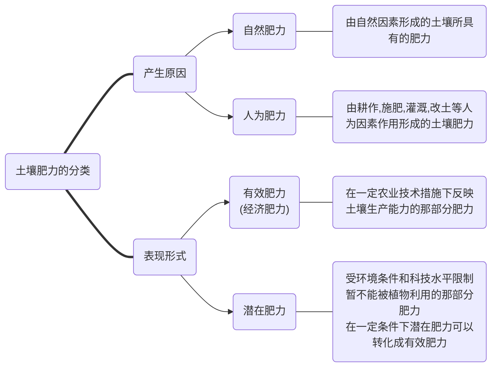

# 土壤肥料学通论


[TOC]


## **第一章：绪论**

### 1. 土壤

- **土壤的概念**
  - 陆地表面由矿物质、有机物质、水、空气和生物组成、具有肥力且能生长植物的未固结层

- **土壤的基本物质组成**
  - 

- **土壤肥力的概念**

  - 土壤供应与协调植物正常生长发育所需的养分、水分、空气和热量的能力

    （狭义：土壤供给植物必须养分的能力）




### 2. 肥料

- **肥料的概念**
  - 能够直接共给植物生长的必须的营养元素物料（分为有机、化学肥料）


## **第二章：土壤的基本物质组成**

### 1. 土壤矿物质和岩石分化

#### A. 概念

-------

1. **矿物**

   - 定义：土壤风化形成的矿物颗粒统称为土壤矿物质
   - 分类：
     1. **原生矿物**：风化过程中没有改变化学组成而遗留在土壤中的一类矿物
     2. **次生矿物**：原生矿物在风化和成土作用下，新形成的矿物

     ```mermaid
      graph LR
      A(土壤矿物质)==>B1("原生矿物")
      A==>B2("次生矿物")
      B1---|来源|C1(各种岩石受到不同程度的物理风化<br>而未经化学风化的碎屑物)
      B2---|来源|D1(由原生矿物经风化后重新形成新的矿物<br>其化学组分和构造都经过改变)
      B1---|主要种类|C2("主要包括石英和原生硅铝酸盐类")
      B1---|对土壤肥力的贡献|C3("主要分布在土壤的沙砾和粉粒为<br>植物生长发育提供矿质养分，并对植物体起支撑作用")
      B2---|主要种类|D2("主要包括简单盐类、次生氧化物和次生铝硅酸盐类等")
     ```

2. **岩石**

   - 定义：由一种或集中矿物组成的集合体    

   - 分类：<u>岩浆岩、沉积岩和变质岩</u>

     > 岩浆岩：地球内部熔融岩浆上浸地壳的一定深度或喷出地表冷却凝固所形成的岩石
     >
     > 沉积岩：地壳表面的岩石经风化、搬运、沉积等作用后在一定条件下胶结硬化形成
     >
     > 变质岩：岩浆岩或沉积岩受地壳运动或岩浆运动造成的高温高压和热气液作用发生变质产生  

3. **岩石矿物的风化**

   1. 物理风化
   2. 化学风化
   3. 生物风化
   
4. **五大成土因素**

   1. <u>生物</u>
   2. <u>母质</u>
      - 定义：矿物岩石经各种风化作用后形成的疏松多孔体
   3. <u>气候</u>
   4. <u>地形</u>
   5. <u>时间</u>

5. **土壤粒级**

   - 定义：土粒大小的等级
   - 分类：<u>石砾、砂砾、粉砂砾、粘粒</u>

6. **土壤颗粒组成**（土壤机械组成）

   - 定义：土壤中不同粒径矿质颗粒的组合比例，一般以各粒级所占百分比表示

   - > 根据需要，将待测土壤颗粒按照不同土壤粒级进行划分，确定了待测土壤机械组成，然后根据这个机械组成比例确定土壤质地。相对于粒级、质地，起到承上启下的作用

7. **土壤质地**

   - 定义：各粒级土壤颗粒在土壤中所占的相对比例或重量百分数

   - 分类：<u>砂土、壤土、粘土</u>
      ```mermaid
      graph TB
      A(不同质地土壤的肥力特性)===B1("砂土")
      A===B2("壤土")
      A===B3("粘土")
      B1---C1("水：通气透水性强，保水性弱</br>
      	气：通气性好，有机质分解快</br>
      	热：热容量较小</br>
      	肥：含养分少，保肥性差</br>
       	耕性：松散易耕，易沉淀·板结﹑闭气")
     B2---C2("水、气：通气透水性良好</br>
     热、肥：保水保肥，土温稳定</br>
     耕性：耕性较好，宜耕期较长")
     B3---C3("水：透水性差，保水抗旱力强</br>
     气：通气性差</br>
     热：热容量较大</br>
     肥：养分较丰富，保肥力强</br>
     耕性：宜耕期短")
     ```


#### B. 简答

--------

1. **土壤质地与土壤肥力的关系？**
   - 土壤质地是土壤的重要物理性质之一，对土壤肥力有重要的影响
   - 土壤质地常常是土壤通气﹑透水﹑保水﹑保肥﹑供肥﹑保温、导温和耕性等的决定性因素
2. **土壤质地的改良措施？**
   - <u>增施有机肥料</u>（有机质的粘结力比砂粒强，比粘粒弱）
   - <u>掺砂掺粘、客土调剂</u>（泥入砂，砂掺泥，以改良质地，改善耕性）
   - <u>翻淤压砂、翻砂压淤</u>（下层砂土或粘淤土翻到表层使砂粘混合，改良土性）
   - <u>引洪放淤、引洪漫沙</u>（利用洪水中泥沙改良土质）
   - <u>根据不同质地采用不同的耕作管理措施</u>（砂土：深播种，多次少量施肥；粘土：深沟，精耕，适量施肥）
3. **附**

  ```mermaid
      graph LR
      A("矿物岩石")==>|风化作用</br>外力搬运|B1("母质")
      B1==>|"成土作用</br>（搬运和堆积作用）"|B2("土壤")
  ```


### 2. 土壤生物与土壤有机质

#### A. 概念

------

1. **土壤生物**

   - 定义：生活在土壤中的<u>微生物</u>、<u>动物</u>和<u>植物</u>等的总称。即栖居在土壤中的活的有机体。

   - > 作用：（非重点）
     >
     > 1. 土壤动物是物质<u>生物循环的积极参与者</u>
     > 2. 对土壤<u>有机物质</u>进行着强烈的<u>破碎和分解</u>作用
     > 3. 影响土壤腐殖质的形成、养分的富集、土壤结构的形成、土壤剖面的发育以及土壤的通气透水性能。<u>对土壤的理化性质产生显著影响</u>
     > 4. 某些动物对土壤和农、林、牧业生产<u>有一定危害</u>

2. **土壤有机质**

   - 定义：<u>存在于土壤中的所有含碳的有机化合物，主要包括土壤中各种动物、植物残体，微生物体及其分解和合成的各种有机化合物，是土壤肥力的重要物质基础</u>
   - <a id="第二章.2.A.2">来源、存在形态、元素组成、主要化合物组分</a>

    ```mermaid
     graph LR
     A(土壤有机质)===B1["来源"]
     A===B2["存在形态"]
     A===B3["元素组成"]
     A===B4["主要化合物组分"]
     B1---C1("自然土壤")---D1("植物残体")
     C1---D2("土壤中的动物、微生物")
     B1---C2("耕作土壤")---D3("有机肥料的施用")
     C2---D4("作物残体")
     B2---C3("新鲜有机质")
     B2---C4("半分解的有机质")
     B2---C5("腐殖质（占有机质总量85%-90%）")
     B3---C6("C（52%-58%）</br>H（34%-39%）</br>O（3.3%-3.8%）</br>N（3.7%-4.1%）")
     B4---D5("糖类化合物：单糖、双糖、多糖</br>纤维素、半纤维素</br>木质素</br>含N化合物（蛋白质、氨基酸）</br>脂肪、树脂、蜡质和单宁</br>灰分物质（Ca、Mg、K、Na、Si、P、S、Fe、Al、Mn）")
    ```

   - > 土壤有机质的含量在不同土壤中差异很大，含量高的可达**20%~30%**以上(如泥炭土，某些肥沃的森林土壤等〉，含量低的不足**0.5%~1%**（如荒漠土和风沙土等)

   - **土壤有机质的转化**

     1. <u>**矿化**：有机质养分的释放过程，即分解过程</u>

        > <u>有机质在微生物作用下，分解为简单无机化合物的过程</u>
        >
        > 最终产物为CO2、H2O等，而N、P、S等以矿质盐类释放出来，同时放出热量，为植物、微生物提供养分和能量
        >
        > 该过程也为形成土壤腐殖质提供物质来源

     2. <u>**腐殖质化**：土壤腐殖质的形成过程，即合成过程</u>

        > <u>进入土壤中的生物残体，在土壤微生物作用下，合成为腐殖质的过程</u>
        >
        > 腐殖质在土壤中主要和矿物质胶体结合，并形成土壤无机有机复合胶体，这对土壤团粒结构的形成及保持具有重要作用

        - **<u>腐殖化系数</u>**：每克干重的有机质经过一年分解后转化为腐殖质（干重）的克数


#### B. 简答

------------

1. **土壤中有机质的来源及形态？**

   参见上文[<u>*第二章.2.A.2*</u>](#第二章.2.A.2)附图

2. **土壤中有机质的转化包括哪些过程？**

   - 

4. **土壤有机质转化的影响因素有哪些？**
   
   1. 有机质的碳氮比和物理状态
   2. 土壤水、热状况
   3. 土壤通气状况
   4. 土壤酸碱性
   
4. **土壤有机质与土壤肥力的关系？**

6. **如何积累和调控土壤中有机质含量？**

  


### 3. 土壤水分、空气、热量

