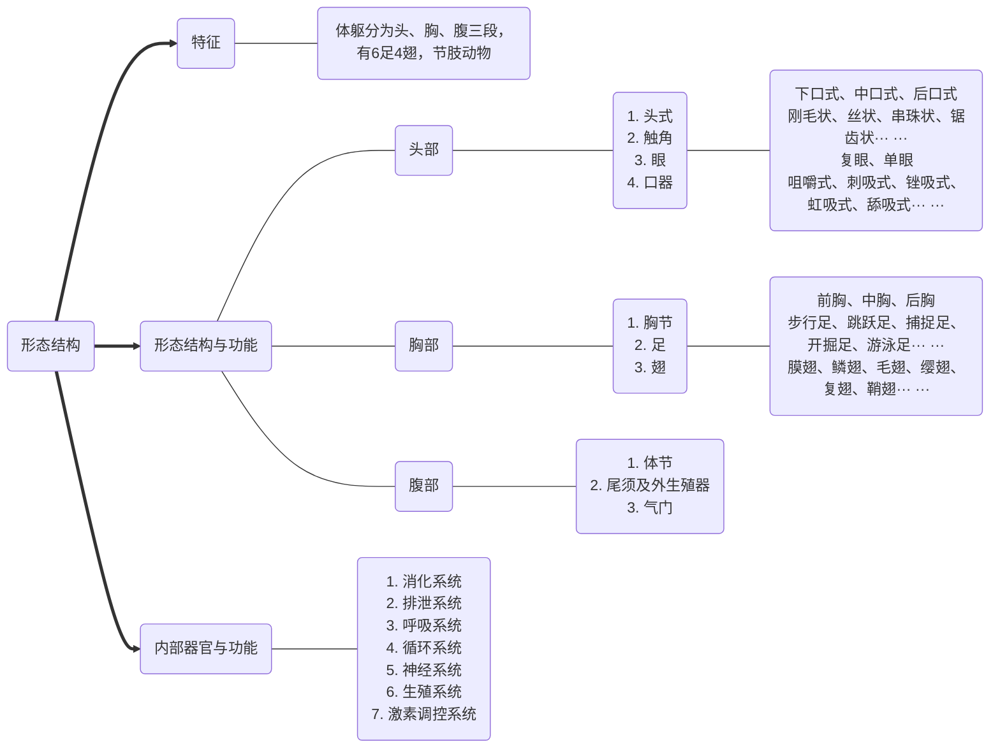

# 植物保护通论复习  *v1.3*


[一些其他的复习资料 (station724.github.io)](https://station724.github.io/TimeInNJAU.github.io/)


[TOC]


## **第一章：绪论**

### 了解即可


## **第二章：植物病害**

### 1. 植物病害三角（P8）

<u>环境、植物、病原物</u>共同构成病害三角。加上<u>“人类干扰”</u>可以构成病害四角


### 2. 病状与病症（P9）

两者的区别为，一个从植物的角度来说，一个从病原物的角度来说。  

> **病状**：<u>植物自身外部表现出的异常状态</u>，常见类型为：<u>变色、坏死、腐烂、萎焉、畸形</u>
>
> **病症**：<u>病原物在植物病部表面形成的各种结构</u>，常见类型为：<u>霉状物、粉状物、绣状物、粒状物、索状物、脓状物</u>
>
> > 通常真菌、细菌病害既有病状也有病症，但病毒和菌原体等病害只能看到病状看不到病症             

​                                                                                                   

### 3. 植物病害的类型（P10）

根据致病因素的性质，通常可以分为侵染性病害和非侵染性病害。

> **病原物**：<u>引起植物病害的生物因素</u>。主要有：<u>真菌、细菌、病毒、线虫和寄生性种子植物</u>等
>
> **侵染性病害**：由<u>生物因素引起</u>的植物病害（传染性病害）
>
> **非侵染性病害**：由<u>非生物因素引起</u>的植物病害（即不适宜的环境条件）（非传染性病害或生理性病害）


### 4. 植物病原物（P11）

- **真菌（P12）**

  1. 植物病原真菌的一般性状

     - 真菌可分为<u>营养体</u>和<u>繁殖体</u>

     - 繁殖体分为<u>无性孢子</u>与<u>有性孢子</u>

       > **无性孢子类型**：<u>游动孢子、孢囊孢子、分生孢子</u>
       >
       > **有性孢子类型**：<u>休眠孢子囊、卵孢子、接合孢子、子囊孢子、担孢子</u>

  2. 植物病原真菌的主要类群
  
     - 包括<u>原生动物界、真菌界、色菌界</u>，其中又以后两者为最重要
  
       1. **原生动物界**：
  
          包括<u>根肿菌门</u>，无性繁殖产生<u>游动孢子囊</u>，有性生殖产生<u>休眠孢子囊</u>
  
          通常引起植物根部或茎部膨大和组织增生
  
       2. **色菌界**：
  
          包括<u>卵菌门</u>，无性繁殖形成<u>游动孢子囊</u>，有性生殖形成<u>卵孢子</u>
  
          1. 腐霉菌（—瓜果腐霉）
          2. 疫霉菌（马铃薯晚疫病—致病疫霉）
          3. 霜霉菌（十字花科霜霉病—寄生霜霉）
  
       3. **真菌界**：
  
          真菌界分为四门一类：<u>壶菌门、接合菌门、子囊菌门、担子菌门、无性菌类</u>
  
          | 类群         | 营养体           | 无性孢子 | 有性孢子 |
          | ------------ | ---------------- | -------- | -------- |
          | **壶菌门**   | 单细胞或无隔菌丝 | 游动孢子 | 休眠孢子 |
          | **接合菌门** | 无隔菌丝         | 孢囊孢子 | 接合孢子 |
          | **子囊菌门** | 有隔菌丝         | 分生孢子 | 子囊孢子 |
          | **担子菌门** | 有隔菌丝         | 多数缺   | 担孢子   |
          | **无性菌类** | 有隔菌丝         | 分生孢子 | 多数缺   |
  
          - 壶菌门（玉米褐斑病—玉蜀黍节壶菌）
          - 接合菌门（甘薯软腐病—匍枝根霉）
          - 子囊菌门常见包括：**（重点）**
            1. 外囊菌（桃缩叶病—畸形外囊菌）
            1. 白粉菌（麦类白粉病—禾布氏白粉菌）
            2. 子囊壳菌（麦类赤霉病—玉蜀黍赤霉）
            3. 子囊腔菌（梨黑星病—纳雪黑星菌）
            4. 子囊盘菌（油菜菌核病—核盘菌）
          - 担子菌门常见包括：
            1. 黑粉菌（小麦散黑穗病—小麦黑粉菌）
            2. 锈菌（小麦条锈病、叶锈病、秆锈病—略）
          - 无性菌类（<u>不完全真菌、半知菌</u>）可分为四类
            1. 丝孢菌（稻瘟病—灰梨孢、玉米小斑病—玉蜀黍双极蠕孢、棉花枯萎病—尖镰孢等）
            2. 黑盘孢菌（棉、麻、苹果的炭疽病—胶孢炭疽菌）
            3. 球壳孢菌（黄麻秆枯病—菜豆壳球孢）
            4. 无孢菌（水稻等作物纹枯病—立枯丝核菌、麦类纹枯病—禾谷丝核菌）
  
- **原核生物（P22）**

  - 原核生物主要包括<u>细菌</u>和<u>菌原体</u>，并主要关注细菌

  - 一般可以分为：<u>革兰氏阴性细菌</u>、<u>革兰氏阳性细菌</u>、<u>菌原体</u>

    1. 革兰氏阴性细菌

       - 黄单孢菌属（水稻白叶枯病—水稻黄单孢菌水稻致病变种）

       - 果胶杆菌属（十字花科蔬菜软腐病—食胡萝卜果胶杆菌食胡萝卜亚种）

    2. 革兰氏阳性细菌

    3. 菌原体

- **病毒（P26）**

  - 病毒引起的病状以花叶为主

  - 病毒的传播一般分为<u>非介体传播</u>和<u>介体传播</u>

      特别要注意介体传播中的<u>口针状型病毒</u>，可以通过<u>汁液接触传播</u>，主要传毒昆虫为<u>蚜虫</u>，引起症状多为花叶
      
      ```mermaid
      graph TB
      A("病毒传播方式（此图非重点）")===B1("非介体传播")
      A===B2("介体传播")
      B1---C1(机械传播)
      B1---C2(无性繁殖材料和嫁接传播)
      B1---C3(种子和花粉传播)
      B2---D1(口针型病毒)
      B2---D2(循回型病毒)
      B2---D3(增值型病毒)
      ```
      
  - 植物病毒的主要类群
  
      1. 烟草花叶病毒属（烟草花叶病毒—烟草、番茄等植物的花叶病）
      2. 黄瓜花叶病毒属（黄瓜花叶病毒—）
  
- **线虫（P31）**（不作要求）

  - 又称蠕虫，不属于昆虫，一般归为病害而不是虫害

- **寄生性种子植物（P33）**（不作要求）

  - 最常提到的有菟丝子
  
  

### 5. 病原物的侵染过程（P35）

- 侵染时期分为：<u>侵入前期、侵入期、潜育期、发病期</u>
- 侵入途径有：直接侵入、自然孔口侵入和伤口侵入


### 6. 病害循环（P37）

- 病害循环：<u>指病害从寄主植物的前一个生长季节开始发病到下一个生长季节再度发病的过程</u>

- 病害循环主要涉及病原物的<u>越冬或越夏</u>、<u>传播</u>和<u>初侵染与再侵染</u>三个方面

  1. 越冬或越夏：

     - 越冬或越夏场所一般也是下一生长季节的初侵染来源地

       包括：有病种苗、田间病株、病残体、病土壤、昆虫介体
  
  2. 传播：包括<u>气流传播、水流传播、昆虫等其他生物传播、人为因素传播</u>四种
  
     - 病原真菌以气流传播为主，其次为水流传播
     - 病原细菌以水流传播为主
     - 植物病毒和菌原体以昆虫等介体传播为主（蚜虫、叶蝉、飞虱）
     - 人类活动对所有病原物的传播特别是远距离传播都是重要的

  3. 初侵染与再侵染：

     - **单循环病害**：指只有初侵染、没有再侵染的病害
  
       - 特点：在植物的一个生长季只有一个侵染过程，潜育期较长
  
       - 例如：小麦散黑穗病、玉米丝黑穗病
       - 防治：只要消除初侵染来源，就可以达到完全防治病害的目的

     - **多循环病害**：指一个植物生长季中具有初侵染和再侵染的病害。

       - 特点：在植物的一个生长季有多个侵染过程，潜育期一般较短
  
         这类病害初侵染数量有限，但通过不断再侵染使其迅速蔓延而引起流行
  
       - 例如：稻瘟病、水稻白叶枯病、小麦条锈病、小麦白粉病、玉米小斑病
       - 防治：一般通过种植抗病品种、改善栽培措施和多次药剂防止来降低病害发展速度，控制病害危害
  
       

### 7. 植物病害的诊断（P40）

- 科赫法则（了解）

  1. 植物病部常伴有病原生物存在
  2. 将该生物在培养基上分离和纯培养
  3. 将纯培养生物接种相同植物的健株，接种植株表现与原来相同的症状
  4. 从接种发病的植株上再次进行该生物的分离和纯培养，其特征与原接种的病原生物相同

- 侵染性病害的特点与诊断

  - 真菌病害

    - 症状：<u>坏死、腐烂和萎焉，少数为畸形</u>

    - 特点：<u>在病斑上常常有霉状物、粉状物、粒状物等病征</u>

  - 细菌病害

    - 症状：<u>坏死、腐烂、萎焉和肿瘤等，并时常有菌脓溢出</u>

    - 特点：

      1. <u>病部常为水渍状或油渍状</u>
      2. <u>在潮湿条件下，病部有黄褐色或乳白色、胶黏、似水珠状的菌脓</u>
      3. <u>腐烂型病害病部往往有恶臭味</u>
    
    - 特别：徒手切片可以观察到<u>**溢菌现象**</u>

  - 病原体病害（不作要求）

    - 症状：黄化、矮化、丛枝、花变叶及果实畸形等

  - 病毒病害（不作要求）
  
    - 症状：**<u>花叶</u>**、黄化、矮缩、皱缩、丛枝等，少数为坏死斑点
  
  - 线虫病害（不作要求）
  
    - 病状：植株矮小、叶片黄化、局部畸形和根部腐烂等
  
  

  
  
  
  

## **第三章：植物虫害**

### 1. 昆虫的形态结构（P44）


  - **特征**：体躯分为头、胸、腹三段，有6足4翅，节肢动物
  
  - **形态结构与功能**
  
    - **【头部】**
    
      - **头式**
    
        1. <u>下口式</u>：适合咀嚼植物性食料，常见蝗虫、螽斯和鳞翅目的幼虫等
        2. <u>前口式</u>：适合捕食动物或其他昆虫，常见虎甲、步行虫、草蛉等
        3. <u>后口式</u>：适合刺吸植物或动物汁液，常见椿象、蚜虫、蝉、叶蝉等
    
      - **触角**
    
        - 嗅觉、触觉器官，基本构造为<u>柄节、梗节和鞭节</u>
        - 刚毛状、丝状、串珠状、锯齿状、球杆状、锤状、具芒状、羽毛状、鳃叶状、环毛状
    
      - **眼**
    
        1. 复眼：昆虫成虫期和不完全变态昆虫的若虫期都有1对复眼
    
           因复眼故很多害虫都有趋绿性，其中蚜虫趋黄
    
        2. 单眼
    
      - **口器**
    
        1. 咀嚼式口器：蝗虫、鳞翅目幼虫等
        2. 刺吸式口器：蚜虫、叶蝉等
        3. 锉吸式口器：蓟马类昆虫特有
        4. 虹吸式口器：鳞翅目成虫特有
        5. 舔吸式口器：双翅目蝇类特有
        6. 幼虫的口器：鳞翅目幼虫变异的咀嚼式、蝇类幼虫刮吸式、脉翅目幼虫捕吸式等
    
    - **【胸部】**
    
      - **胸节**基本构造：前胸、中胸、后胸，其中后两者具翅
      - **足**：步行足（步甲）、跳跃足（蝗虫）、捕捉足（螳螂）、开掘足（蝼蛄）、游泳足（仰泳椿）、抱握足（龙虱）、携粉足（蜜蜂）、幼虫的前足（鳞翅目）
      - **翅**
        - 由背板向两侧扩展而来，成虫期昆虫一般有两对翅，生在中胸的为前翅，后胸的为后翅。少数种类只有一对翅或完全无翅。不完全变态昆虫若虫期翅在体外发育，完全变态昆虫幼虫期翅在体内发育
        - 膜翅（蚜虫、蜂类、蝇类）、鳞翅（蝶类、蛾类）、毛翅（石蛾）、缨翅（蓟马）、复翅（蝗虫、蝼蛄、蟋蟀的前翅）、鞘翅（金龟甲、叶甲、天牛等的前翅）、半鞘翅（椿象的前翅）、平衡棒（蚊、蝇的后翅）
    
    - **【腹部】**
    
      - 末端有尾须及外生殖器，两侧有气门，内脏大部分位于腹腔内。腹部是昆虫新陈代谢与生殖的中心
      - 不同昆虫有不同数目的体节，每个腹节只有背板和腹板而没有侧板。
    
    - **【体壁】**（不作要求）
  
  - **昆虫内部器官与功能**
  
    1. 消化系统
       - 常见的如<u>BT毒素</u>即作用于消化系统
    2. 排泄系统
    3. 呼吸系统
       - 常见的<u>熏蒸</u>的杀虫剂使用方式即利用的是呼吸系统
    4. 循环系统
    5. 神经系统
       - 是当前绝大部分杀虫剂的作用方式，如<u>有机磷杀虫剂</u>
    6. 生殖系统
    7. 激素调控系统
       - 内激素：<u>脑激素</u>、<u>蜕皮激素</u>、<u>保幼激素</u>（分别为脑神经细胞、前胸腺、咽侧体分泌）
       - 外激素：即信息激素，常见有<u>性外激素</u>（昆虫引诱剂）、示踪外激素、警戒外激素和群集外激素等




### 2. 昆虫的生殖方式（P58）

- **了解各种生殖方式的概念，能够提出例子**

1. <u>两性生殖</u>

   - 昆虫繁殖最普遍的方式

2. <u>孤雌生殖</u>

   卵不经过受精而发育成新个体的生殖方式称为孤雌生殖

   - 经常性孤雌生殖：蓟马、介壳虫、粉虱等昆虫，没有雄虫或雄虫极少，完全或基本上以孤雌生殖进行繁殖
   - 周期性孤雌生殖或异态交替：蚜虫从春季到秋季连续10代多都是孤雌生殖，不产生性蚜，而当冬季来临前才产生性蚜，交配后产生受精卵跃越冬
   - 偶发性孤雌生殖：家蚕、飞蝗等，偶尔也出现未受精卵发育成新个体的现象

3. <u>卵胎生和幼体生殖</u>

   - 卵胎生：卵在母体内成熟后，并不排出体外，而是停留在母体内进行胚胎发育，直到孵化后直接产下幼虫。常见的有蚜虫的孤雌生殖
   - 幼体生殖：昆虫母体尚未达到成虫阶段，还处于幼虫时期就能进行生殖。常见的有瘿蚊等。凡是幼体生殖的，产下的不是乱，而是幼虫，可以看作一种胎生形式。

4. <u>多胚生殖</u>

   指一个卵发育成2个或更多的胚胎，每个胚胎发育成一个正常新个体的生殖方式。常见的有小蜂科、小茧蜂科、姬蜂科等（多胚生殖是对活体寄生的适应，充分利用寄主繁殖处较多的后代个体）
   
   

### 3. 昆虫的变态发育（P59）

- **变态**：昆虫在胚后发育过程中，从幼期转变为成虫过程中形态发生变化的现象
- 昆虫的变态发育**类型**
  1. **<u>不完全变态</u>**
     - 经过卵、幼虫和成虫三个阶段
     - **若虫**：不完全变态昆虫中的一类幼虫和成虫在形态、食性等方面相似，亦称渐变态，其幼虫称为若虫（可以偏颇的理解为：不完全变态昆虫的幼虫被称为若虫（其实不完全是））
     - 常见有：蝗虫、盲蝽、蜻蜓、螳螂等
  2. <u>**完全变态**</u>
     - 经过卵、幼虫、蛹和成虫四个阶段
     - 幼虫和成虫在外部形态、内部器官、生活习性等方面有显著差异
     - 常见有：蚊、蝇、蝶、蛾、蜂、甲虫等
  3. 增节变态（非重点）
  4. 表变态（非重点）
  5. 原变态（非重点）


### 4. 昆虫的生物学习性（P62）

- **休眠**：昆虫在其年生活史的某一个阶段，由于不适合的环境条件，常引起生长发育停止，不食不动，环境条件一点转变为适宜条件，则生长发育迅速恢复正常状态，的现象
  - 常见的有：小地老虎、黏虫、斜纹夜蛾、甜菜夜蛾、稻纵卷叶螟、东亚飞蝗等的冬眠
- **滞育**：某些昆虫在一定的季节、一定的发育阶段，无论环境条件适宜与否，而出现生长发育停止，不食不动的现象
  - <u>光周期</u>是最常见的诱导因素，感受光周期信号的虫期叫<u>感受态虫期</u>，一般在滞育虫期之前
  - 引起昆虫种群中50%个体进入滞育的光周期界限称为<u>临界光周期</u>
  - 玉米螟、棉铃虫、二化螟等以滞育虫态越冬，大地老虎、麦红吸浆虫等以滞育虫态越夏
- **假死性**：一些昆虫收到某种刺激或震动时，身体蜷缩，停止不动，或从停留处跌落下来呈假死状态，稍停片刻即恢复正常的现象
  - 成虫如金龟子、猿叶虫、象鼻虫等；幼虫如小地老虎、斜纹夜蛾等具有假死性
- **趋性**：指昆虫对外界刺激所产生的趋向或背向行为活动（正趋性、负趋性）
  - 常见刺激物有光、化学物质、温度、湿度等（<u>趋光性</u>、<u>趋化性</u>、趋温性、趋湿性）
- **多型现象**：有些昆虫除成虫期有性二型现象外，同一性别还分化成不同形态，具有不同生活习性的现象
  - 如蚜虫在”食物充足“与”食物不充足或居住空间拥挤“的情况下分别产生无翅胎生雌蚜和有翅胎生雌蚜
- **食性**：昆虫对食物的选择性称为食性
  - 通常分为<u>植食性</u>（三化螟、菜粉蝶等）、<u>肉食性</u>（螳螂、瓢虫等）、<u>腐食性</u>（果蝇、埋葬虫等）和<u>杂食性</u>（蟋蟀、蚂蚁等）
- **群集性**：同种昆虫的大量个体大量聚集在一起生活的习性，称为群集性
  - 通常分为<u>临时性群集</u>（越冬时的瓢虫）和<u>永久性群集</u>（群居型飞蝗）
- **迁移性**：某种昆虫成群地从一个发生地转移到另一个发生地的现象
  - 常见的有东亚飞蝗、稻纵卷叶螟、稻褐飞虱、草地螟、白背飞虱等


### 5. 植食昆虫及其危害（P65）

- 昆虫分为2个亚纲（无翅亚纲、有翅亚纲）34个目，其中8个目与农业密切相关
  1. 直翅目
     - 常见：蝗虫、蟋蟀、蝼蛄等
     - 体中到大型；咀嚼式口器；前翅复翅，后翅膜翅；不完全变态
  2. 半翅目
     - 统称椿象
     - 体小到中型；刺吸式口器；前翅半鞘翅，后翅膜翅；不完全变态
  3. 同翅目
     - 常见蚜虫、粉虱、介壳虫、飞虱、叶蝉等
     - 体小；刺吸式口器；翅膜质或革质；不完全变态；存在两性生殖、孤雌生殖、有性生殖、有性与无性交替等
  4. 缨翅目
     - 通称蓟马
     - 体微小；锉吸式口器；不完全变态；一般两性生殖，很多种类无雄虫，孤雌生殖
  5. 鞘翅目
     - 通称甲虫
     - 体小至大型；咀嚼式口器；前翅鞘翅，后翅膜质；完全变态
  6. 鳞翅目
     - 包括所有蝶类、蛾类
     - 体小至大型；虹吸式口器；完全变态
     - 螟蛾科：二化螟、三化螟、稻纵卷叶螟
     - 夜蛾科：大螟、棉铃虫、地老虎
     - 麦蛾科：红铃虫
  7. 膜翅目
     - 蜂类、蚂蚁等
     - 体小至中型；咀嚼式或咀吸式口器；翅膜质；完全变态；两性生殖、单性孤雌生殖或多胚生殖
  8. 双翅目
     - 蚊、蝇、虻等
     - 体小至中型；头下口式；刺吸式或舐吸式口器；仅有一对膜翅的前翅，后翅特化为平衡棒；完全变态
  
- **吸收式害虫**可依据口器分为：

  1. 刺吸式：多为半翅目、同翅目，包括椿类、叶蝉类、飞虱类、蚜虫类、蚧类、粉虱类等
  2. 锉吸式：缨翅目蓟马
  3. 虹吸式：鳞翅目吸果夜蛾类害虫（造成落果）
  4. 刮吸式：双翅目多种植食性蚊类和蝇类

  - 其中又以刺吸式害虫种类最多，危害最大
  - 最终导致卷曲、皱缩、畸形和枯萎，导致直接危害；也会间接传播病毒病

- **咀嚼式害虫**主要为咀嚼式口器，主要集中在直翅目、鞘翅目、鳞翅目和膜翅目，通常包括

  1. 食根类害虫：也称地下害虫，直翅目蝼蛄；鞘翅目叩头甲、金龟甲；鳞翅目地老虎等
  2. 食叶类害虫
     - 暴露危害类：东亚飞蝗、黏虫、菜粉蝶、斜纹夜蛾等
     - 潜藏危害类：稻纵卷叶螟、麦蛾、草地螟等
  3. 蛀茎类害虫：亚洲玉米螟、二化螟、三化螟、大螟等
  4. 蛀果类害虫：红铃虫、棉铃虫、烟夜蛾等
  5. 贮粮害虫：玉米象、印度谷螟等

  - 常导致出现田间缺苗端垄（地下害虫）、顶芽停止生长、叶片残缺不全（咀嚼式害虫）、茎叶枯死折断（蛀茎类害虫）、花蕾和果实受害等


## **第四章：农田草害**

### 1. 杂草的概念与生物学特性（P99）

- **杂草的概念**：杂草是一类能够在人类试图维持某种植被状态的生境中不断自然延续其种群，并影响到人工植被状态维持的一类植物
- **杂草的适应性**
  1. 抗逆性
  2. 可塑性
  3. 生长势
  4. 杂合性
  5. 拟态性
     - 伴生杂草：在形态、生长发育规律以及对生态环境的要求上与作物相似，很难将这些伴生杂草与其伴生的作物分开或从中清除。常见：**稗草和水稻**、**野燕麦和麦类**、**狗尾草和谷子**
- **杂草的繁殖能力**
  1. 多实性
  2. 繁殖方式多样性
  3. 子实传播方式多样性
  4. 种子的寿命长且萌发不齐
  5. 有性生殖方式复杂


### 2. 杂草生态学（P101）

- **<u>杂草个体生态（种子休眠、种子萌发）</u>**

- **<u>杂草种群生态</u>**

  1. 杂草种子库

  2. 杂草的种群动态

  3. 杂草与作物间的竞争

  4. **杂草的竞争临界期和经济阈值**

     - 竞争临界期：当杂草生长存留造成的作物产量损失量和无草状态下作物产量增加量相等时的天数
     - 经济阈值：危害经济阈值指防治后作物增加的效益和防治费用相等的草害情况

  5. **化感作用**：<u>植物向环境释放出特定的化学物质，影响周围其他植物生长发育的现象</u>

     - 具有化感作用的化学物质被称作化感作用化合物

       - 直接由植物体分泌、分解而来为<u>原生化感作用化合物</u>，产生的化感作用称为<u>真化感作用</u>

       - 植物经微生物等降解产生的化感作用化合物，间接来自于植物，称为<u>次生化感作用化合物</u>，产生的化感作用称为<u>功能性化感作用</u>

     1. 化感作用化合物及其来源：多是植物次生代谢化合物，通过<u>挥发、淋溶、根分泌和植物残体的分解</u>等方式进入环境
     2. 化感作用机理和意义：化感作用化合物影响植物生长发育和生理生化代谢过程，作用机理有：
        1. <u>抑制种子萌发和幼苗生长</u>
        2. <u>抑制蛋白质合成及细胞分裂</u>
        3. <u>抑制光合作用和呼吸作用</u>
        4. <u>抑制酶活性</u>
        5. <u>影响水分代谢和营养的吸收</u>

     - 化感作用是植物间竞争的一种手段，可以利用化感作用<u>培养化感作物品种</u>，达到少用或不用除草剂的目的。此外，<u>合理的作物轮作和套作</u>也可以达到抑制杂草的发生与危害的目的。
     - 化感作用也可以用来<u>研制、开发新除草剂品种（如激素类除草剂）</u>
  
- **<u>杂草群落生态</u>**

  农田杂草在一定环境因素的综合影响下，形成不同杂草群落的有机组合，这样的在一定环境条件下重复出现的杂草种群组合，称为杂草群落

  - 杂草群落与环境因子之间有密切关系。杂草群落的形成、结构、组成、分布一方面直接受土壤水分、肥力、酸碱度、耕作、地形和地貌等影响，另一方面间接受到轮作和种植制度、季节、气候和海拔等影响
  - **杂草群落的演替及顶级群落**
    - <u>群落演替</u>：指杂草群落在农业措施和环境条件变换作用下，一个杂草群落为另一个杂草群落取代的过程
    - <u>顶级杂草群落</u>：一种可以适应某种农业措施作用总和的动态稳定状态
      1. 水稻田：以稗草为优势种的杂草群落
      2. 稻茬麦田：以看麦娘为优势种的杂草群落
      3. 北方旱茬麦田：以野燕麦为优势种的杂草群落
      4. 秋熟旱作物田：大多为以马唐为优势种的杂草群落


### 3. 杂草的分类（P109）

- 形态学分类
  1. <u>禾草科</u>：主要包括禾本科杂草
     - 看麦娘、日本看麦娘（看麦娘是稻麦油菜连作区危害最为严重的杂草，杂草群落优势种）
     - 野燕麦（旱性麦地主要杂草，多为杂草群落优势种）
     - 菵草（稻茬麦（油菜）田主要杂草）
     - 马唐、毛马唐（秋熟旱地危害最终的两种主要杂草）
     - 稗（稻田危害最为严重一类杂草）
     - 牛筋草、向茅、千金子、硬草，狗尾草等
  2. <u>莎草科</u>：主要包括莎草科杂草
     - 异形莎草、香附子、水莎草、牛毛毡等
  3. <u>阔叶草科</u>：包括所有的双子叶植物杂草及部分单子叶植物杂草
     - 矮慈姑（多发于中和晚季水稻）
     - 芥菜（夏熟作物田主要杂草，可作蔬菜）
     - 菟丝子、铁苋菜、马齿苋等

- 其他分类（不作要求）
  - 生物学特性分类：一年生、二年生、多年生杂草
  - 茎的性质：草本类杂草、木本类杂草
  - 营养方式：自养型杂草、寄生型杂草
  - 生境生态学分类：耕地杂草、杂类杂草、水生杂草、草地杂草、森林杂草、环境杂草
  - 系统学分类：禾本科、莎草科、泽泻科、菊科、十字花科··· ···


## **第六章：农业有害生物的发生规律及预测**

### 1. 植物病害的流行（P156）

- 病害流行的类型

  1. **单循环病害**

     指在病害循环过程中只有初侵染而没有再侵染，或有再侵染但是作用较小的病害

     - 多为<u>种子传播的病害或土壤传播</u>的全株性或系统性病害。其<u>自然传播距离较近，传播效能较小</u>
     - 病原物可产生抗逆性较强的休眠体越冬，越冬率高，较稳定。每年的流行程度主要取决于初始菌量，初侵染结束后当年病害发生的数量就基本定局。其在一个生长季节中菌量增长幅度不大，但能够逐年积累，稳定增长，若干年后导致较大的流行，也称为<u>“积年流行病害”</u>
     - 例如：水稻恶苗病、稻曲病、大麦条纹病、小麦散黑穗病、小麦腥黑病、小麦全蚀病、小麦线虫病、玉米丝黑穗病、棉花枯萎病和黄萎病以及多种果树病毒病等

  2. **多循环病害**

     一个生长季节中病原物能够连续繁殖多代，从而发生多次再侵染的病害

     - 大多数是<u>局部侵染</u>，寄主的感病时间长，病害的潜育期短。病原物的<u>增殖率高，但其寿命不长，对环境条件敏感</u>，不利条件下会迅速死亡
     - 病原物越冬率低，越冬后存活的菌量不高，在有利条件下增长率很高，病害增幅大，可以在一个生长季节完成菌量积累，造成当年病害严重流行，又称为<u>“单年流行病害”</u>
     - 例如：稻瘟病、稻白叶枯病、麦类锈病、玉米大小斑病、马铃薯晚疫病等

  - **防治**
    - 防治单循环病害，消灭初始菌源很重要，除选用抗病品种外，田间卫生、土壤消毒、种子消毒、拔除病株等措施都有良好防效
    - 防治多循环病害，应当种植抗病品种，采用药剂防治和农业防治措施，降低病害的增长率

- 病害流行因素

  - 应依据病害三角进行分析，包括存在感病寄主植物、强致病性的病原物、有利的环境条件等


### 2. 植物病虫害预测（P173）

- 害虫预测方法

  1. 发生期预测

     - 发育进度预测法

       根据害虫田间发育进度的调查结果，参考当时气温预报，加上相应虫态历期，推算以后虫态发生时间

       1. **历期法**

          对前一虫态（或虫期）的田间发育进度（如化蛹率、羽化率）进行系统调查，当调查到其百分比达到始盛期（16%）、高峰期（50%）和盛末期（84%）时，分别加上当时气温下各虫期的历期，就能推导出后面某一虫期的发生时间

       2. **分龄分级法**

          选择害虫幼虫期和蛹期做1~2次发育进度调查，记录幼虫各龄的数量，分别计算百分率。如调查蛹，应计算各级蛹在样本中的百分率，根据各虫龄的累计百分率，确定可以用来预测始盛期（16%）、高峰期（50%）和盛末期（84%）的主要虫源，然后根据该虫源从该虫龄到成虫所需的发育天数，进行预测

       3. **期距法**

          期距指各虫期在田间出现始盛期（16%）、高峰期（50%）和盛末期（84%）间隔的时间距离，是多年调查的虫情资料中得出的经验值或历史平均值。查准害虫当前发育进度，再加上期距，即可准确预测下一虫态或虫期的发生时间

     - 物候法（不作要求）

     - 有效积温法（不作要求）

  2. 发生量预测（不作要求）


## **第七章：农业有害生物的防治技术与策略**

### 1. 有害生物防治技术（P185）

分为植物检疫、农业防治、抗害品种的利用、生物防治、物理机械防治和化学防治六大类

- **植物检疫**

  - 定义：是国家或地区政府，为防止危险性有害生物随植物及其产品的人为传播，以法律手段和行政措施强制实施的保护性植物保护措施

- **农业防治**

  - 通过适宜的栽培措施降低有害生物种群数量或减少其侵染可能性，培育健壮植物，增强植物抗害、耐害和自身补偿能力，以减少有害生物危害损失的一种植物保护措施

  1. 改进耕作制度
  2. 使用无害种苗
  3. 调整播种方式
  4. 加强田间管理
  5. 安全收获

- **作物抗害品种的利用**

  - 植物的抗害性与抗害机制

    - 植物的抗害性类型
      1. 依据抗性表现的程度可以分为<u>免疫、高抗、中抗、中感、高感</u>
      2. 依据其对病菌生理小种或害虫生物型的反应，分为<u>垂直抗性、水平抗性</u>
         - 垂直抗性：也称专化抗性或特异抗性，指作物品种只对一种或几种病菌生理小种或害虫生物型表现抗性，而对另一些则不表现抗性。垂直抗性通常表现出较高水平的抗性，但较容易因病菌生理小种或害虫生物型的变化而丧失
         - 水平抗性：作物品种对病菌的各种生理小种或害虫的各种生物型均具有相似的抗性，抗性水平常较低，但不会因病菌生理小种或害虫生物型的变化而丧失
    - 植物的抗害机制
      1. <u>抗选择性</u>（病虫害不选择植物侵害）
      2. <u>抗生性</u>（病虫害侵染后死亡、生长受抑制）
      3. <u>避害性</u>（病虫害虽然侵染，但是不能造成危害或损失；作物易受害期和病虫发生期错开）
      4. <u>耐害性</u>（病虫害侵害后，植物忍受、补偿能力较强，不表现明显症状或产量损失）

  - 作物抗害品种的选育

    - 育种目标的确定（不作要求）
    - 抗源材料的收集（不作要求）

    - 抗性育种方法
      1. 传统技术
      2. 诱变育种
      3. 组织培养技术
      4. 分子生物学技术
         - 解决了传统育种技术无法克服的远源杂交障碍问题
         - 可以通过基因改造，创造新抗性
         - 基因改造也可以去除某些病毒侵染时所需的寄主体内具备的识别因子或专一性毒素受体
         - 可以利用有害生物关键基因构建抗害遗传材料，通过基因干扰进行抗害育种

  - <u>作物抗害品种的利用</u>（合理利用）
    1. 利用抗性品种应该纳入综合防治体系，与其他综防措施相配套
    2. 适宜的利用垂直抗性和水平抗性，以延缓抗性丧失
    3. 利用群体遗传学方法原理，采取适宜的治理措施，例如不同抗性机制的品种轮作、镶嵌式种植，利用庇护地措施等
    4. 培育多抗性品种，使之兼抗多种有害生物

- **生物防治**

  利用有益生物及期产物控制有害生物种群数量的一种防治技术

  - 生物防治的<u>途径</u>
    - 保护有益生物
    - 引进有益生物
    - 有益生物的人工繁殖与释放
    - 生物产物的开发利用
  - 生物防治技术的<u>应用</u>（了解，举出例子）
  - 生物防治<u>特点</u>
    - 从保护生态环境和可持续发展的角度来说，生物防治是最好的有害生物防治方法
    - 从有害生物治理和农业生产的角度看，生物防治仍有很大的局限性，尚无法满足农业生产和有害生物治理的需要
    - 从发展的角度看，面对环境与可持续发展问题，生物防治措施与生态环境保护具有相融性，与农业可持续发展具有统一性

- **物理防治**

  - 常用方法有：人工和简单机械捕杀、温度控制、<u>诱杀</u>（<u>灯光诱杀、食饵诱杀、潜所诱杀</u>）、阻隔分离和微波辐射等

- **化学防治**

  - 农药的种类
    1. 杀虫剂（红色）
    2. 杀菌剂（黑色）
    3. 除草剂（绿色）
    4. 杀鼠剂（蓝色）
    5. 植物生长调节剂（黄色）
  - 农业的剂型
    - 乳油、粉剂、可湿性粉剂、粒剂、可溶性粉剂、悬浮剂、缓释剂、超低量喷雾剂、种衣剂、烟剂
  - 农药使用方法
    - 喷雾法、喷粉法、撒施或泼浇法、拌种、毒饵法、熏蒸法等
  - 农药登记的三个阶段
    - 田间试验阶段
    - <u>临时登记阶段</u>（有效期1年，可以续展，累积有效期不超过三年）
    - 正式登记阶段（有效期5年，可以续展登记）


### 2. 有害生物防治措施（P213）

- 我国植物保护方针：“**<u>预防为主，综合防治</u>**”（1975年农业部主持召开的植物保护工作会议）
- 综合防治目标：**<u>经济效益、生态效益和社会效益</u>**


## **第九章：植物保护技术推广**

### 1. 植物保护技术推广形式（P285）

1. 服务式技术推广
2. 行政式技术推广
3. 教育式技术推广


### 2. 植物保护技术推广体系（P286）

1. 植保教育
2. 植保科研
3. 植保器材供应
4. 植保技术推广管理


##  **题型**

1. 填空题           （共20分，每空0.5分）
2. 不定项选择题（共20分，每题2分）
3. 判断题            （共10分，每题1分）
4. 名词解释        （共10分，每题2分）
5. 简答题            （共20分，每题5分）
6. 论述题            （共20分，每题10分）
- 如有出入，以卷面实际标注为准


## **附件**

### GitHub

https://github.com/Station724/TimeInNJAU.github.io.git


### 植物保护通论重点—于娜—录音.m4a

https://njau-my.sharepoint.cn/:u:/g/personal/14819131_njau_edu_cn/EdA64k3lnRBBir1veuO7SiEBhU5qZBPa7jd6j5H6joAKvQ?e=FWL4Qt

**密码：14819131**


*V1.0_20211226*__整理完毕

*V1.1_20220102*__修正若干bug，添加附件链接

*V1.2_20220102*__修改若干错别字

*V1.3_20220107*__添加GitHub链接

